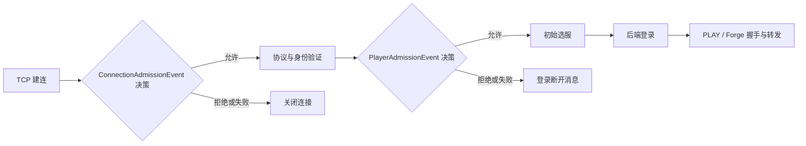

# 架构与边界

本文记录当前源码已经实现的边界。构建与运行限制见[运维与验证](operations.md)；项目现有概览见 [README](../README.md)。

## 模块

- `proxy-plugin-api` 定义插件外部接口：生命周期、玩家/服务器只读视图、后端注册、类型化事件、初始选服、命令和转服。核心实现位于 `proxy-core`；可选发现器位于 `plugins/`。
- `ProxyMain` 读取严格 YAML 配置，先注册静态后端，再加载配置启用的插件，连接插件选服回调，最后启动 Netty 监听器。插件以 `META-INF/services/dev.strataproxy.api.Plugin` 声明，通过独立类加载器加载。
- 核心支持 Minecraft 1.7.10（协议 5）登录和转发。`OFFLINE` 信任客户端提交的名字；`ONLINE_BUNGEE` 在代理执行加密与会话验证，并将身份转发给受信任的旧版 Bungee 后端。

入口可从 [`ProxyMain`](../proxy-core/src/main/java/dev/strataproxy/app/ProxyMain.java)、[`ProxySessionListener`](../proxy-core/src/main/java/dev/strataproxy/core/session/ProxySessionListener.java) 和 [`PluginHost`](../proxy-core/src/main/java/dev/strataproxy/core/plugin/PluginHost.java) 追踪。

## 会话与连接生命周期

`ProxySessionListener` 负责接入限额、监听器生命周期和 UUID 到当前会话的索引；每个 `Session` 持有该连接的前端/后端通道和协议状态。玩家身份由 UUID 与连接代次组成。插件查询使用不可变 `PlayerView`；异步工作返回时会核对当前连接身份，避免旧连接结果作用于重连后的同 UUID 玩家。在线列表来自活动会话，不另存一份可竞争的玩家状态。

连接首先派发 `ConnectionAdmissionEvent`（如有订阅），再解析 Handshake/Login Start。在线模式完成加密与 `ONLINE_BUNGEE` 会话验证，离线模式生成离线身份；随后派发 `PlayerAdmissionEvent`（如有订阅）、执行异步初始选服，再连接后端并写入 Login Start。后端 Login Success 校验通过后发布在线玩家视图，并派发 `ServerConnectedEvent`，再向客户端提交登录成功并进入双向转发。此时初次 PLAY/Forge 握手可能尚未完成；转服还要等待该握手就绪。身份冲突、协议错误、登录阶段失败和断线会关闭本次连接并释放索引与资源。登录失败原因可以编码成客户端断开消息；网络关闭或帧处理错误则清理连接。曾发布的玩家关闭时恰好派发一次 `PlayerDisconnectedEvent`。

普通转发沿用协议 5 帧边界，不重新编码普通帧。前后端通道绑定同一 Netty EventLoop，会话控制状态在该循环串行变更。Keep Alive ID 由代理转换并跟踪未完成请求；必要的玩家实体 ID 数据包在转服后改写。通道不可写时通过暂停对端读取施加背压。实现见 [`Session`](../proxy-core/src/main/java/dev/strataproxy/core/session/Session.java)、[`RawRelay`](../proxy-core/src/main/java/dev/strataproxy/core/relay/RawRelay.java) 与 [`KeepAliveBridge`](../proxy-core/src/main/java/dev/strataproxy/core/session/KeepAliveBridge.java)。

## 后端目录与发现所有权

静态配置和插件注册共用核心后端目录。插件通过 `Servers.find/all` 取得 `ServerView` 快照；`ServerView` 仅含名称、地址、标签和插件元数据，不含负载、玩家数或容量。插件以 `Servers.register` 获得所有权句柄，可更新或注销自己的条目；不能替换静态配置或其他插件拥有的同名项。重新注册同名项会生成新一代句柄，使旧句柄失效。选服拿到的是当时的后端快照，目录之后更新不改变已经开始的连接。

默认初始选服遍历当前目录并选择注册顺序中的第一个后端；有玩法选服逻辑时由插件的初始选服回调负责决定。代理不推断后端健康或空岛可用性。插件关闭时，宿主撤销该插件名下的注册和命令。

核心还可启用独立的后端控制通道：每个后端实例以单独连接完成认证、注册和插件消息交互，不依赖玩家连接；短暂断线的注册保留到租约到期，消息调用立即报告连接不可用。控制通道不能覆盖静态后端或插件拥有的名称。详见[后端控制通道](backend-channel-design.md)。

## 转服、并发与错误边界

转服先在旧后端保持服务的同时连接并登录候选后端。普通后端在 Join Game 后可进入切换；Forge 候选后端要等待客户端 Forge 握手链路切换及 Join Game，再进行世界切换。交接期间客户端与旧后端帧分别进入有上限的缓冲区；切换前失败时尽可能恢复旧链路并回放暂存帧，成功时改用候选链路并清理旧链路。候选连接失败不会立即破坏旧链路；Forge 客户端切换包写出后若目标拒绝或超时，旧链路无法安全恢复，代理会关闭会话。`NETWORK_READY` 只表示协议握手和代理发出的世界切换已完成，不表示目标服插件或玩法世界已准备好。接口定义见 [`Players`](../proxy-plugin-api/src/main/java/dev/strataproxy/api/Players.java)、状态见 [`TransferStatus`](../proxy-plugin-api/src/main/java/dev/strataproxy/api/TransferStatus.java)。

主要并发和失败界限：

- 玩家会话的可变控制状态限制在前端 EventLoop；登录验证、后端地址解析及插件回调不在该状态路径中同步等待。
- 插件初始选服和命令分别使用固定线程数、有界队列的工作池。排队饱和会拒绝当前操作；选服失败或超时只结束该次登录请求，不会自动卸载插件。命令异常会记录并返回通用失败文本。
- 玩家断线会取消未决选服请求并移除尚未运行的工作；已开始的插件异步任务只能尽力取消。宿主关闭会结束未决请求，逆序调用插件关闭钩子，并在统一期限后继续回收类加载器和注册。
- 转服缓冲有帧数和字节上限；超过上限、协议帧损坏或关键通道写失败会结束该会话。连接到达 `maxConnections` 时，新连接被直接关闭，该数包括尚未登录的连接。

玩家主动消息与断开沿用同一连接身份和 EventLoop。消息限制为每连接最多 64 条未完成写入；登录、首次 Forge 握手未完成和转服交接期间不接受消息。主动断开设置终止状态，阻止迟到的异步回调恢复转发，按客户端实际协议阶段发包，并在有限期限内清理。插件只接触 `Players` 和操作结果，不获得内部会话对象。详见[玩家操作设计](player-operations.md)。

服务器列表展示由不可变 `ServerListStatus` 编码；启动时校验文本与图标，预构造静态字段，请求时只填入当前在线人数。列表人数上限与接入资源上限分开配置。

日志统一通过 SLF4J 输出，发行包使用 Logback。访问策略不依赖额外的核心负载观测或健康状态模型。

## 事件与玩家准入

玩家名/UUID 和来源 IP 的允许/拒绝判断及其封禁数据库属于 Ban 插件策略，不应放进后端目录或发现插件。连接准入事件在 TCP 建立后、协议解析前触发；玩家准入事件在身份建立后、后端登录前触发。`ONLINE_BUNGEE` 会话验证仍由核心执行，玩家准入事件只在验证之后触发；离线模式同样触发该事件，并以 `authenticated=false` 标记未认证身份。两种决策事件和 `ServerConnectedEvent`、`PlayerDisconnectedEvent` 使用同一个 `Event<R>`、`EventListener<E,R>` 与 `Events.subscribe` 机制。准入链按注册顺序运行，首个拒绝即停止；异常、空结果、超时和队列过载均失败关闭。准入队列有界（128，最多 1024 个未决请求），单事件链期限默认 5 秒、范围 1–30 秒。生命周期通知在同一个统一派发实现中采用异步 FIFO 策略（128 项加一个活动事件）；会话不等待，过载尽力丢弃并聚合记录。订阅只能在 `onLoad`/`onEnable` 注册，监听器启动前冻结；插件停用或失败时自动清理。检查不进入 PLAY 包热路径；目前没有基准证明性能收益或无开销。API 示例与配置细节见[插件接入说明](plugins.md)。

## 相关源码

- 插件 API：[`PluginContext`](../proxy-plugin-api/src/main/java/dev/strataproxy/api/PluginContext.java)、[`Servers`](../proxy-plugin-api/src/main/java/dev/strataproxy/api/Servers.java)、[`Players`](../proxy-plugin-api/src/main/java/dev/strataproxy/api/Players.java)
- 会话和转服：[`Session`](../proxy-core/src/main/java/dev/strataproxy/core/session/Session.java)、[`TransferCandidate`](../proxy-core/src/main/java/dev/strataproxy/core/session/TransferCandidate.java)、[`TransferFrameBuffer`](../proxy-core/src/main/java/dev/strataproxy/core/session/TransferFrameBuffer.java)
- 目录：[`BackendCatalog`](../proxy-core/src/main/java/dev/strataproxy/core/backend/BackendCatalog.java)、[`InMemoryBackendCatalog`](../proxy-core/src/main/java/dev/strataproxy/core/backend/InMemoryBackendCatalog.java)
- 后端控制通道：[`BackendControlService`](../proxy-core/src/main/java/dev/strataproxy/core/control/BackendControlService.java)
