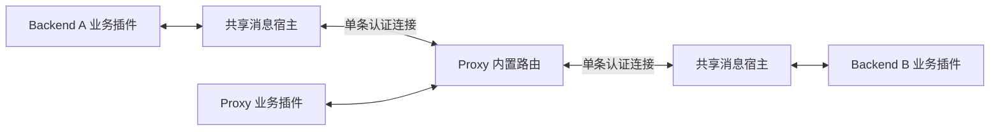

# 后端 Channel 消息服务

业务插件通过命名 channel 与 proxy 或指定 backend 通信。每个后端由一个宿主持有认证控制连接，多个插件共享；proxy 内置路由，后端之间通信不需要另写代理转发插件，也不依赖在线玩家。

模型推导、失败语义及验收条件见 [设计契约](channel-messaging-v2.md)。消息服务与 Minecraft PLAY 转发独立；现有后端注册、心跳租约和游戏地址目录继续由控制服务维护。



## 参与者、Channel 与消息

- `Endpoint.proxy()`、`Endpoint.backend("island-b")` 表示目标节点。
- `islands:control` 这样的 channel 表示业务域及权限边界；目标 backend 名称不编码进 channel。
- `Message` 包含 UUID `id`、`kind`、`channel`、认证 `source`、`target`、`replyTo` 和复制后的二进制 `payload`。普通调用由框架生成这些元数据；业务消息类型与数据版本由 payload 表达。
- 通知使用 `subscribe`，同一节点同一 channel 可有多个订阅者。请求使用 `onRequest`，同一节点同一 channel 只能有一个处理者；重复注册会失败。
- `request` 返回完整回复消息。回复有自己的 `id`，`replyTo` 等于请求的 `id`；经 proxy 转发保持原始消息身份。来源由认证连接确定，不能相信 payload 中自称的发送者。

后端共享一个认证主体，代理不能独立认证其中每个业务插件。本地插件 owner 用于生命周期清理，不是新的跨进程安全身份。连接代次留在传输实现中。

## 后端插件接入

在 Bukkit/Uranium 后端安装一次 `backend-bukkit` 生成的 `moonbridge-backend-bukkit` JAR，插件名为 `MoonBridgeBackend`。配置唯一的实例 ID、后端名称、代理控制地址、游戏地址与凭据。宿主异步建立连接，不在启动主线程等待网络。

消费者 `plugin.yml` 声明：

```yaml
depend: [MoonBridgeBackend]
```

消费者依赖独立的 `uk.potatolab.moonbridge:backend-bukkit-api`，它传递依赖平台无关的 `messaging-api`。源码默认 `0.1.0-SNAPSHOT` 是本地开发版本；使用已发布构件时，必须将示例中的 `<published-version>` 替换为 CI 成功发布的准确不可变版本。`backend-bukkit` 是部署到服务器的宿主实现，`backend-channel-client` 是其他平台实现宿主时使用的传输 SDK，普通业务插件不依赖它们。发布版本及构件列表见[发布与依赖版本](publishing.md)。

Gradle 示例（Bukkit API 仍由业务插件按目标服务器版本自行声明）：

```kotlin
repositories {
    maven("https://git.nest.potatolab.uk:8443/api/packages/layue13/maven")
}
dependencies {
    compileOnly("uk.potatolab.moonbridge:backend-bukkit-api:<published-version>")
}
```

Maven 使用同一坐标并设置 `<scope>provided</scope>`。本地开发可改用 `0.1.0-SNAPSHOT`，但不要把它当作已发布版本。发行包的 `backend-api/` 也包含编译所需的 API JAR，适合隔离构建环境直接编译。本例中的 Bukkit API 仍由业务插件按目标服务器版本自行声明为 `compileOnly` / `provided`。不要把 API、SDK 或宿主实现重新打包进业务插件 JAR，也不要把 API JAR 单独放进服务器 `plugins/`；运行时由 `MoonBridgeBackend` 提供同一份 API 类和服务实现。

```java
import dev.moonbridge.bukkit.BukkitMessagingService;
import dev.moonbridge.messaging.Endpoint;
import dev.moonbridge.messaging.MessageChannel;
import dev.moonbridge.messaging.Messaging;

// 在业务插件的 onEnable 中取得服务；plugin.yml 声明 depend。
BukkitMessagingService service = getServer().getServicesManager()
    .load(BukkitMessagingService.class);
if (service == null) throw new IllegalStateException("MoonBridgeBackend service is unavailable");
Messaging messaging = service.forPlugin(this);
MessageChannel channel = messaging.channel("islands:control");

channel.subscribe(message -> handleNotice(message));
channel.onRequest(message -> CompletableFuture.completedFuture(query(message.payload())));

channel.send(Endpoint.proxy(), noticeBytes);
channel.send(Endpoint.backend("island-b"), noticeBytes);
channel.request(Endpoint.backend("island-b"), queryBytes, Duration.ofSeconds(3))
    .thenAccept(reply -> logReply(reply.id(), reply.replyTo(), reply.payload()));
```

宿主在游戏主线程调用通知/请求处理器；业务应快速返回，耗时操作返回异步 stage。不要在游戏主线程对网络 future 调用 `get` / `join`。Future 的后续回调不保证在游戏主线程，操作 Bukkit 游戏对象前应显式安排主线程任务。

`forPlugin` 对同一个启用中的插件返回同一 scope。消费者停用时，宿主自动关闭它的 scope，撤销注册并结束未决调用；其他插件继续工作。宿主停用则关闭唯一的连接。需要提前停止服务时，也可主动 `messaging.close()`。

非 Bukkit 宿主可以创建一次 Java 8 `BackendChannelClient`，通过 `client.messaging(owner, executor)` 给各插件提供 scope，并负责调用 scope/client 的 `close`。普通业务插件不持有凭据或直接构造客户端。

## Proxy 插件接入

```java
MessageChannel channel = context.messaging().channel("islands:control");
channel.onRequest(message -> prepare(message.payload()));
channel.subscribe(message -> audit(message.id(), message.source()));
channel.send(Endpoint.backend("island-a"), bytes);
channel.request(Endpoint.backend("island-b"), bytes);
```

Proxy 为每个插件管理独立的 scope，在停用时自动撤销。项目处于开发阶段，旧 `backendChannels()`、裸字节处理器及直接客户端消息方法已经移除；两端插件统一使用 `messaging()` API。

## 交付、发布与故障

`send` 是定点通知，其 `SendReceipt` 含消息 ID。`ACCEPTED` 只表示目标节点的消息服务接受了有界处理任务，不表示业务执行完成；没有订阅者、目标断连、过载和权限拒绝分别为 `NO_SUBSCRIBER`、`NOT_CONNECTED`、`BACKPRESSURED`、`REJECTED`。`TIMED_OUT` 表示未及时收到回执，`FAILED` 表示其他故障，这两者均不能证明业务尚未执行。

`request` 是一对一请求。超时从提交时开始，覆盖排队、传输和等待回复；默认 5 秒，最长 60 秒。无处理器、超时、断线、权限拒绝和处理失败有可区分的错误。过期的排队请求不能恢复后再发出。

`publish(payload)` 面向 proxy 与当前有接收权限的在线 backend，包括发布者自身；节点按当时的本地订阅者分发。返回结果按候选节点列出投递状态，也会包含 `NO_SUBSCRIBER`。多节点投递不是原子事务，部分节点可能接受、部分失败。首版按在线连接扇出，避免维护远端订阅目录及其重连同步状态。一次发布最多 256 个候选节点（包含 proxy）；超过时在任何投递前明确拒绝，不截断结果。定点 `send` / `request` 不受此发布上限影响。

消息不离线保存，断线不自动重放。超时或断线不能证明远端没有执行；需要重试的业务应有自己的稳定幂等键。UUID 提供身份和追踪能力，不承诺 exactly-once。多个并发请求可以乱序回复，框架根据关联信息匹配。

## 配置与部署

代理在 `backendChannel.listen` 启动独立监听器。配置示例见 [moonbridge-channel.example.yml](../proxy-core/src/main/resources/config/moonbridge-channel.example.yml)。每个实例的 `secret` 至少 32 个 UTF-8 字节，`allowedHosts` 限制其广告游戏地址；`allowedNamespaces` 控制发送，`allowedReceiveNamespaces` 控制接收，未配置接收列表时继承发送列表，显式空列表表示禁止该方向的所有消息。跨后端路由同时检查源发送权限与目的接收权限。Channel registration v3 将代理启动 epoch 和 backend registration epoch 同时交给后端。代理用该 backend client secret 为发往该 backendName 的 legacy forwarding handshake 生成短时 HMAC 会话证明；证明绑定两端当前 epoch、backendName、UUID、connectionId、一次性 nonce 和到期时间。后端 `MoonBridgeBackend` 校验它并把会话绑定到实际 Bukkit Player 登录对象。两端身份或 secret 不匹配、registration 未完成或 epoch 已变化时，`BukkitSessionService.find(player)` 返回空值。证明不代表任何 AetherShard 操作。

在 `OFFLINE` 代理模式中，只有显式配置了该 backend 的 session-binding secret 时，代理才会在初始连接或转服时转发由代理派生的 offline UUID 和会话证明；这证明代理连接身份，不表示 Mojang 已认证。没有配置 secret 的 offline backend 仍接收原始握手。静态 backend 或尚未获得正数 registration epoch 的目标不会收到会话证明。

实例的游戏地址必须是代理实际可达的 `tcp://host:port`。Docker 中使用容器服务名，容器间不要使用 `127.0.0.1`。仅将玩家端口公开，控制端口放在私有网络。不要把真实凭据写入镜像或提交到仓库。

HMAC 挑战认证本身不加密链路；跨机器使用私有加密链路或可信 TLS 终止器。每个实例配置独立的实例 ID、后端名称和密钥；重复认证同一实例会接管旧连接，旧连接的迟到回复不能影响新连接。

协议已升级为版本 2，proxy 与后端宿主必须一起升级；旧协议和 Java API 已移除，版本 1 连接会明确拒绝。关闭时在有限等待内尝试发送注销帧，代理收到后立即注销目录；若链路阻塞或意外断线，则保留到租约过期，不强制关闭已经存在的玩家游戏连接。

## 验证范围

自动化验证针对 Java 8 API/宿主字节码、宿主 JAR 打包边界、真实 TCP 的零玩家双向及跨后端请求、发布、多插件关闭、并发回复关联、超时与异常帧。构建和独立 TCP 测试不能代替真实 Bukkit/Uranium 装载、玩家整合包验收或生产容量测试。

本次构建、244 项回归和实际 Java 8 进程的结果见 [2026-09-27 验证记录](../smoke/results/2026-09-27-channel-messaging.md)。

安装发行包的 `backend-host/` 提供可直接安装的共享宿主 JAR；`backend-client/` 提供非 Bukkit 宿主所需的 SDK、消息 API 和协议三个 JAR。运行 `:proxy-core:installDist` 后，可用实际 JDK 8 运行独立进程验收：

```powershell
.\smoke\channel-java8.ps1 -Java8Home 'C:\path\to\jdk8' -Java25Home 'C:\path\to\jdk25'
```

脚本用 JDK 25 启动本机 router，再用 JDK 8 编译并运行两个后端客户端，校验请求关联、来源与三个插件订阅者；不启动 Minecraft 玩家或 Bukkit 服务端。
