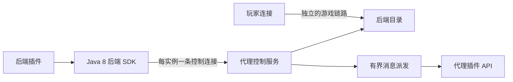

# 后端控制通道

控制通道已经提供第一版实现：每个后端实例主动连接代理的独立端口，在没有在线玩家时注册，并与代理插件双向交换消息。它不使用 Minecraft PLAY 插件消息，也不使用 HTTP 注册或 DNS 发现。

## 组成与部署



代理在 `backendChannel.listen` 启动第二个监听器。每个实例用独立的 `instanceId`、`backendName`、凭据和游戏端口注册；同一 IP 可以承载多个不同端口的实例。代理侧不需要为每个实例启动单独的插件或 HTTP 端点。控制通道只创建动态目录条目，不能覆盖静态后端或其他实例拥有的名称。

示例配置见 [`strataproxy-channel.example.yml`](../proxy-core/src/main/resources/config/strataproxy-channel.example.yml)。`clients` 中每个实例的 `secret` 至少 32 个 UTF-8 字节，`allowedHosts` 限制它可广告的游戏主机名或 IP，`allowedNamespaces` 限制它可以发往代理插件的消息命名空间。后端注册地址必须是代理实际可达的 `tcp://host:port`；只有代理与后端同机时，才能使用 `127.0.0.1` 作为游戏地址。不要把示例密钥用于实际部署。

后端插件只依赖 `backend-channel-client`，该模块按 Java 8 字节码编译，不依赖 JDK 25 的 `proxy-plugin-api` 或代理核心。创建一个 `BackendChannelClient` 后，它会连接、注册、发送心跳并在断线后重连。构造器中的 `generation` 应在进程启动时生成一次 UUID，重连期间保持不变。

### Docker 部署

代理容器运行 JDK 25，后端容器按服务端要求运行 Java 8；两者加入同一个私有 Docker 网络。代理配置中的 `listen` 和 `backendChannel.listen` 在容器内绑定 `0.0.0.0`，分别监听玩家端口和控制端口。仅将玩家端口发布到宿主机；控制端口只需在容器网络内可达。后端 SDK 的代理地址填 Docker 网络中的代理服务名（例如 `proxy:28081`），游戏地址填代理可达的后端容器名和实际端口（例如 `tcp://island-a:25565`）。`allowedHosts` 应列出这个游戏地址的主机名。这里的容器 DNS 只用于连接已配置的服务名，不承担后端发现或注册。

每个后端实例使用独立的 `instanceId`、`backendName`、游戏地址和密钥；同一台宿主机上的不同容器不能把 `127.0.0.1` 当作彼此的地址。不要把真实密钥写入镜像或提交到仓库；启动时挂载由部署系统生成的代理配置，并向后端插件注入对应密钥。跨宿主机部署还需要私有加密链路或 TLS 终止器。可运行 `sh smoke/container-channel.sh`，在 Docker bridge 中验证注册、登录、注销和已有玩家连接继续转发。

```java
BackendChannelClient channel = new BackendChannelClient(
    "127.0.0.1", 28081, "island-a", "island-a", "tcp://127.0.0.1:25565",
    UUID.randomUUID().toString(), "primary", secretBytes);
channel.registerHandler("islands:echo", payload ->
    CompletableFuture.completedFuture(payload));
// 服务端插件关闭时调用 channel.close()。
```

代理插件通过 `PluginContext.backendChannels()` 使用通道。处理器在 `onLoad` 或 `onEnable` 注册，同一通道只能有一个处理器；插件关闭时自动撤销。`BackendMessage` 含代理认证过的 `backendName`、`instanceId` 和连接代次，处理器应使用这些字段判断来源，不应信任负载里自称的身份。

```java
context.backendChannels().subscribe("islands:prepare", message ->
    prepare(message).thenApply(ignored -> new byte[0]));
context.backendChannels().send("island-a", "islands:notice", bytes);
context.backendChannels().request("island-a", "islands:echo", bytes);
```

## 注册、断线与安全

代理先发送协议版本和随机挑战。后端以实例 ID、名称、游戏地址、启动代次、密钥 ID 和覆盖这些字段的 HMAC-SHA256 签名注册；验证成功且目录写入完成后，代理返回连接代次。认证失败、名称冲突或广告主机不在允许列表时，不会创建目录条目。重复连接同一实例会接管旧连接，旧连接的回调和清理不能修改新条目。

SDK 默认每 10 秒发一次心跳，代理默认租约为 30 秒，可在配置中调整。意外断线时，消息调用立即失败，目录条目保留到租约到期；期间玩家连接仍可能尝试该游戏地址。重连并重新认证后恢复消息通道。正常关闭会发送 `GOODBYE` 并立即注销。目录撤销不会强制踢掉已经在该服的玩家。

控制协议本身没有加密。跨机器部署应把控制监听器放在私有加密链路后，或使用可信 TLS 终止器；HMAC 不能防止窃听。当前每个实例配置一个密钥 ID 和密钥，轮换需要协调更新配置与客户端。代理对未认证连接设握手期限，并限制连接数、帧长、每连接队列、在途请求和入站消息速率。

## 消息语义

第一版支持单向 `send` 和带回复的 `request`。消息是二进制负载，最大 64 KiB；代理每连接最多排队 1 MiB 或 128 条出站消息、128 个在途请求，默认请求期限 5 秒。入站处理器使用独立于玩家准入和命令的有界工作池。代理 `send` 返回 `SENT` 只说明写入控制连接，不代表后端插件已处理；断线、过载和无处理器分别有明确失败结果。后端 SDK 也限制在途请求和处理器队列。

控制通道不保存离线消息，不保证断线前的请求是否已被远端执行，也不跨连接代次自动重放。业务重试需要自己的幂等键；可靠保存的玩法数据仍应写入业务存储。消息收发不进入普通 PLAY 转发路径。

## 验证范围

自动化测试覆盖零玩家通信、同 IP 不同端口注册、双向请求、无处理器响应、无效凭据、旧连接接管和意外断线后租约过期。Java 8 SDK 已通过 Java 8 编译；真实 Forge/Uranium 服务端装载、跨机器加密链路和生产负载仍需在目标部署环境验证。源码入口为 [`BackendControlService`](../proxy-core/src/main/java/dev/strataproxy/core/control/BackendControlService.java)、[`BackendChannels`](../proxy-plugin-api/src/main/java/dev/strataproxy/api/BackendChannels.java) 和 [`BackendChannelClient`](../backend-channel-client/src/main/java/dev/strataproxy/backendchannel/BackendChannelClient.java)。
