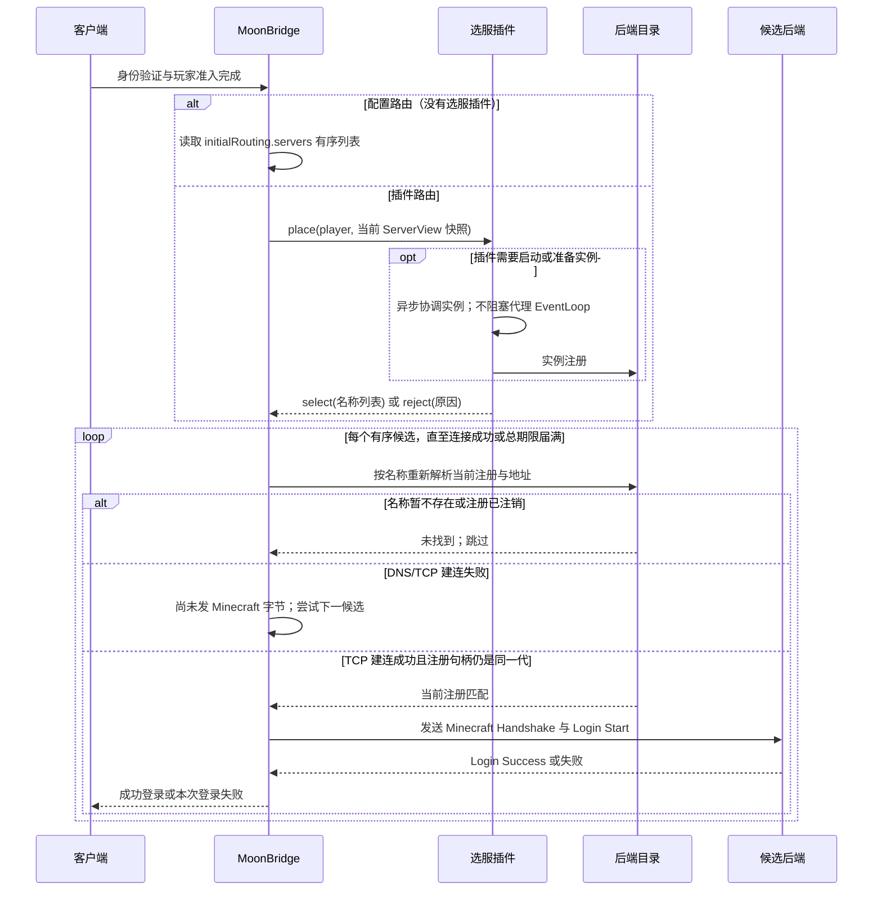

# 初次登录路由设计

## 问题与边界

客户端完成身份建立与访问检查后，代理需要选择一个后端，才能开始 Minecraft 登录。静态后端配置、插件注册和后端控制通道都只是目录来源；目录登记表示“可寻址”，不表示“应该接收新玩家”，也不提供健康、容量、空岛状态或玩家归属信息。登录路由因此必须来自一项明确的策略。

策略只有一个权威来源：没有插件选服处理器时，使用 `initialRouting.servers` 配置的有序目标；有处理器时，由该插件完全负责选择。静态配置不会在插件拒绝、出错、超时或选出的目标失效后悄悄接管。这样空岛、回归玩家、维护模式和大厅分流等规则由其业务插件明确决定，代理只执行路由契约。

## 决策流程与时限



身份验证、玩家准入有各自期限；`initialRouting.timeoutSeconds` 从选服开始计时，覆盖插件异步选择、每个候选的 DNS 解析和 TCP 建连总时长，而非每个候选各自重新计时。它默认 15 秒，取值为 1–120 秒。后端 TCP 成功后，代理检查原注册句柄及地址仍然有效，再开始协议登录；开始协议登录后恢复既有 15 秒后端登录期限。

自动重试边界刻意收窄：候选缺失/注销可跳过；DNS 或 TCP 连接失败可在总期限内继续。第一次向后端发送任何 Minecraft 握手或登录字节后，不再重试其他目标。后端拒绝、关闭、协议错误或超时都会结束本次玩家登录。Forge 登录流量不会复制到另一个后端，以免重放产生双重会话或协议状态不一致。

## 静态配置

```yaml
initialRouting:
  servers: [lobby-a, lobby-b]
  timeoutSeconds: 15
```

`servers` 按顺序列出明确作为入口的后端名，最多 16 个，每个名称至多 128 个字符，必须唯一、非空白并且不带首尾空格。代理从目录中解析这些名称；它们可来自静态 `backends`、插件注册或后端控制通道。列表为空是有效配置，但没有插件策略时玩家登录会 fail-closed，并收到“未配置入口服务器”的提示。生产配置应列出明确的大厅，或者安装自己的选服插件。

迁移旧配置时，将原先隐式依赖“第一个注册的后端”的预期改成 `initialRouting.servers` 的显式顺序。`plugins.initialPlacementTimeoutSeconds` 已由统一的 `initialRouting.timeoutSeconds` 取代。

## 插件策略

实现 `Plugin.initialPlacementHandler()` 提供全代理唯一的初始选服策略。处理器收到玩家视图和调用时的不可变 `ServerView` 快照，返回异步的 `PlacementDecision.select(name)`、`PlacementDecision.select(names)` 或 `PlacementDecision.reject(reason)`。名称列表表达重试优先级，最多 16 个且不允许重复；缺失目标会由代理跳过。每个实际连接尝试均按名称重新读取当前目录注册，因此插件可以先异步协调实例启动，待动态注册完成后返回其名称。处理器不得阻塞；其 stage 可能因玩家断线、选服总期限或代理关闭而被尽力取消。

此契约不会替插件实现持久唤醒任务、排队玩家或目录轮询。确需实例准备时，业务插件在选服 stage 中异步协调，并在路由期限内返回已注册的目标；超时/启动失败由插件作出明确拒绝或失败。跨进程任务恢复、排队与容量控制属于业务系统，不能靠代理登录线程等待实现。

建议由单个业务路由插件聚合多个业务规则，避免多个插件争夺全局目的地。例如它可以先按玩家 ID 查询岛屿归属，再请求实例管理器准备对应后端，最后返回目标名称；代理不需要了解岛屿模型。

## 失败语义

| 情况 | 结果 |
| --- | --- |
| 没有插件且静态列表为空 | 明确拒绝本次登录 |
| 插件显式 reject、抛错、返回空值或异步超时 | 拒绝本次登录；不回退到静态列表 |
| 候选未注册或已注销 | 跳过候选，继续有序列表 |
| 候选地址无效，或 DNS/TCP 建连失败 | 跳过候选，继续有序列表 |
| TCP 成功但注册代次/地址在建连期间变化 | 关闭该 socket，不向它发 Minecraft 数据，再尝试下一候选 |
| 所有候选均无效/不可达，或路由总期限届满 | 拒绝本次登录 |
| 已发送后端协议登录数据后拒绝、断开、超时或协议失败 | 结束本次登录；不重试、不重放 |
| 玩家在处理期间断线 | 取消未决路由；忽略迟到的插件结果并回收候选连接 |

## 验收契约

实现验收应分别证明：默认空路由拒绝且从未注册目录顺序隐式挑服；配置目标按声明顺序连接；单插件的多候选顺序、显式拒绝和异常不会触发静态回退；插件异步期间新注册目标可按名称解析；注册注销或同名换代不会复用旧地址；前序 DNS/TCP 故障会尝试下一目标；任何后端 Minecraft 登录字节发出后都不会重试；插件选择加多次建连共享一个有界总期限；断线、超时和代理停服会忽略迟到结果并关闭临时 socket。

这些是验收要求而不是本文件对运行时通过状态的声明。自动化测试、隔离协议烟测、真实后端登录与完整客户端/Forge 登录属于不同证据层级；各自结果必须单独记录。

本次专项测试与真实 Uranium 协议登录结果见[验收记录](../smoke/results/2026-09-27-initial-routing.md)。
